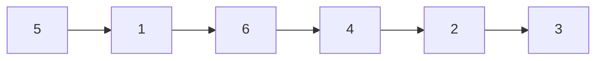
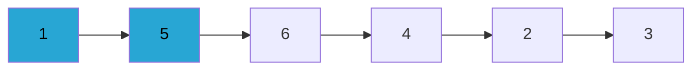
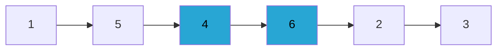
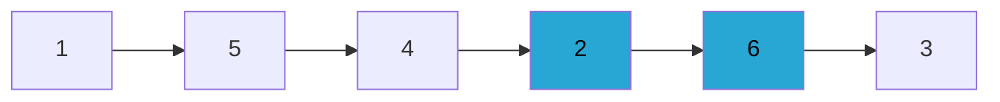
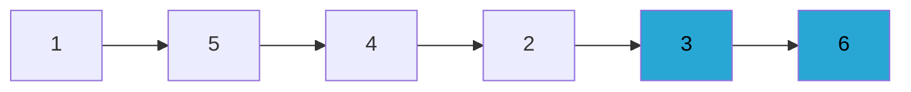
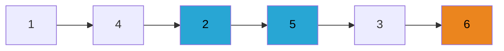
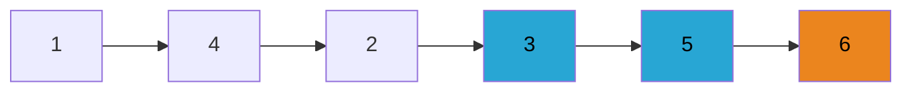
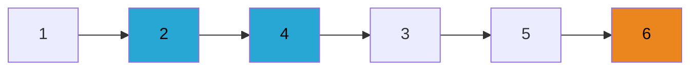
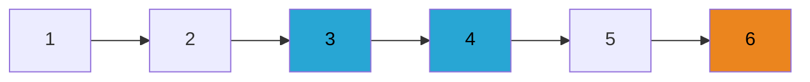

# Bubble Sort 

데이터 집합을 순회하면서 집합 내의 이웃 요소들끼리의 교환을 통해 정렬을 수행한다. 

----

마지막 6은 제외하고 정렬 계속....

-------
버블정렬은 범위가 n개라면 n-1 만큼 반복하면서 정렬이 마무리 된다. 

버블 정렬의 비교 횟수  = (n-1)+(n-2)+(n-3)+(n-4)+...+(n-(n-2))+(n-(n-1))

버블 정렬의 비교 횟수  = (n-1)+(n-2)+(n-3)+(n-4)+...+3+2+1

$$
버블 정렬의 비교 횟수= \frac { n*(n-1) } { 2 }
$$

데이터 범위(n)이 30,000개라면, 
$$
버블 정렬의 비교 횟수= \frac { 300000*(299999) } { 2 } = 449,985,000 =  약 4억 5천만회
$$

버블 정렬은 그닥 효과적인 알고리즘은 아니지만, 

이러한 알고리즘을 이해하고 있어야 효율적인 알고리즘이 얼마나 필요한지 느낄 수 있다. 

