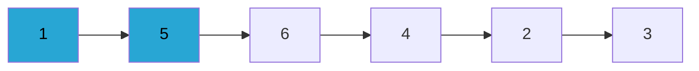
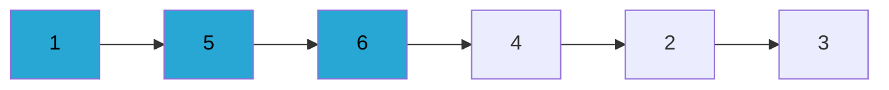
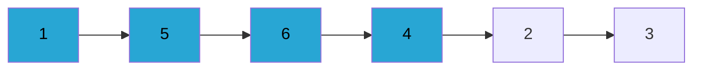
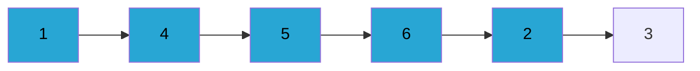
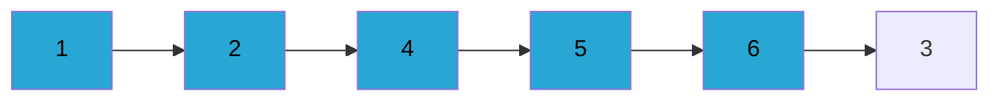
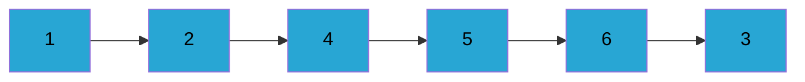
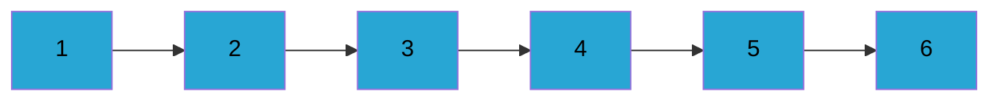

# Insertion Sort

데이터 집합을 순회하면서 정렬이 필요한 요소를 뽑아내어 이를 다시 적당한 곳에 삽입해 나가는 알고리즘이다. 

----

카드 두개를 선택하여 둘중 큰 값을 오른쪽에 둔다.

6번 카드까지 범위를 넓혀 세개의 숫자 중 가장 마지막 장 6과 5를 비교하여 더 큰 값을 오른쪽에 둔다.(변동없음)

가장 오른쪽에 있는 값 4는 바로 앞의 6보다 작으므로 앞의 숫자들과 비교하여 제대로 위치를 잡아준다.

-----
버블 정렬과는 반대로 삽입 정렬은 정렬 대상을 하나씩 늘려나가는 방식 돌아간다. 

$$
삽입 정렬의 비교 횟수= \frac { n*(n-1) } { 2 }
$$

버블 정렬과 동일하다 생각할 수 있다. 차이점이 있다. 

버블 정렬은 데이터 집합이 정렬되어 있든 난잡하게 흩어져 있든 
$$ \frac { n*(n-1) } { 2 } $$
위의 공식 대로 동일하게 비교를 거친다.

삽입 정렬은 데이터 집합이 정렬되어 있는 경우 한번도 비교를 거치지 않는다. 

즉, 정렬된 경우 비교 횟수가 0회 지만, 최대로 복잡하게 섞여 있는 경우 와의 평균을 구한다면 
$$ \frac {\frac { n*(n-1) } { 2 } + (n-1)} {2} = \frac {n^2+n-2}{2} 회$$ 
정도가 될 것이다. 

즉 똑같아 보이지만, 평균적으로 삽입 정렬이 더 나은 성능을 보일 확률이 놓다. 

### 따라서 비교적 크기가 작은 데이터 집합을 정렬하는 루틴을 작성할 때 버블 정렬 대신 삽입 정렬을 사용하는 것이 좋다.
