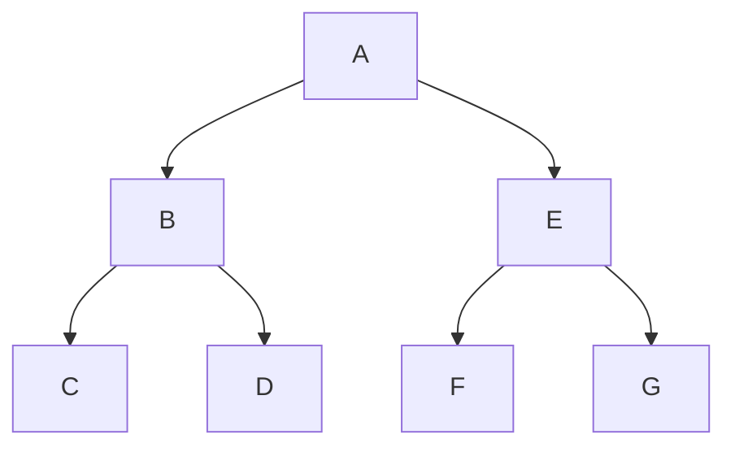
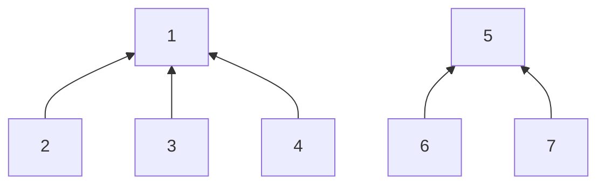
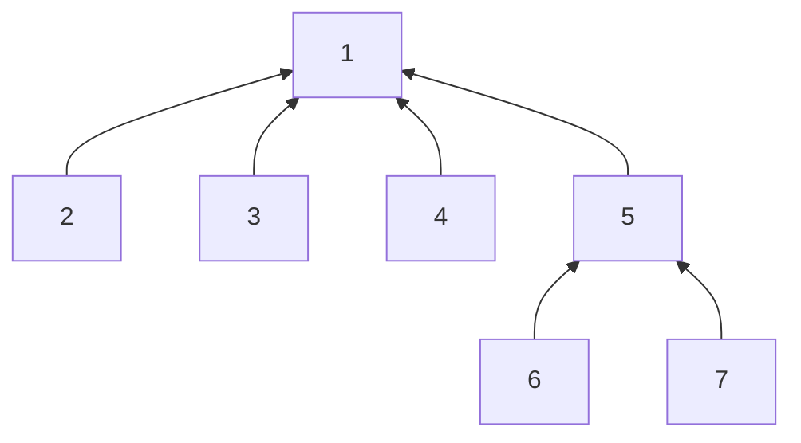

# 이진트리 

모든 노드가 최대 2개의 자식을 가질 수 있는 트리 

데이터를 담는 용도로는 별로이지만, 역으로 이런 구조를 이용한 훌륭한 알고리즘들이 개발되어 있다. 

그 예로,

수식 계산에 사용되는 수식 이진 트리,  이진 탐색트리는 <mark>빠른 데이터 검색</mark>을 가능케 해준다. 

------
## Full Binary Tree

포화이진트리

잎 노드들이 모든 같은 깊이에 존재한다는 것이 특징이다. 

완전이진트리  Complete Binary Tree

포화 이진트리와는 비슷하지만 포화 이진 트리를 이루기 전 단계의 트리도 있다. 

잎 노드들이 트리의 왼쪽부터 차곡차곡 채워진 것이 특징이다. 노드가 하나라도 비면 완전이진트리가 될 수 없다. 

----

이진 트리는 나무 모양의 자료를 담기 위한 자료구조가 아니라 컴파일러나 검색 등에 사용되는 특수 자료구조이다. 

특히 이진 트리를 이용한 검색에서는 높은 성능을 위해 트리의 노드들을 가능한 한 완전한 모습으로 배치하는 것이 필수입니다. 

**그래서 완전한 모습의 트리가 어떤 것인지를 알고 있어야 한다.**

-----

이진 트리의 상태를 분류하는 용어가 있다. 

- 높이 균형 트리 Height Balanced Tree
    > 루트 노드 기준으로 왼쪽 하위 트리와 오른쪽 하위 트리의 높이가 1이상 차이나지 않는 이진 트리를 말한다. 

- 완전 높이 균형 트리 Completely Height Balanced Tree
    > 루트 노드 기준으로 왼쪽 하위 트리와 오른쪽 하위 트리의 높이가 같은 이진 트리이다.

### Travelsal  순회
트리 내의 노드들 사이를 규칙성있게 돌아다니는 것이다. 

- 전위 순회 Preorder Traversal
    > A - B - C - D - E - F - G
    >
    > 전위 순회를 이용하면 이진 트리를 중첩된 괄호로 표현할 수 있다. 
    >
    > (A (B(C, D)), (E (F, G)))

- 중위 순회 Inorder Traversal
    > C - B - D - A - F - E - G
    >
    > 왼쪽 맨 아래 하위 노드에서 부터 보모노드 방문 후 형제 노드를 방문한다. 
    > 
    > 중위 순회를 응용하는 대표적 사례가 수식 트리 Expression Tree  이다. 
    >
    > (1 * 2) + (7 - 8)
- 후위 순회 Postorder Traversal
    > C - D - B - E - G - E - A
    > 
    > 전위의 반대로 이다.

## 수식 트리 Expression Tree

- 피연산자는 잎 노드
- 연산자는 루트 노드, 가지 노드

우리가 일반적으로 사용하는 중위 표기식은 컴퓨터가 처리하기 적합하지 않다. (스택을 주로 사용하기 때문에)

중위 순회로 표기된 수식을 후위순환으로 변환한 후에 계산 해야 한다. 훨씬 수월하다는 의미이다.

## 분리 집합 Disjoint Set
교집합 Intersection 을 갖지 않는 집합들 

서로 공통된 원소를 갖지 않는 집합들을 말한다. 

교집합을 만들기 위해서는 분리 집합에는 합집합 Union 만이 있을 뿐이다. 

> 분리 집합은 집합들 간의 교집합을 허락하지 않기 때문에 구분되어야 하는 데이터 집합을 다룰 때 유용하다. 

> 서점에서 책 일렬 번호와 가격을 데이터로 쓰고 있는데, 행사를 위해 특별 가격을 몇몇 책에 부여 한다면, 이러한 경우 행사 가격은 분리 집합으로 관리할 수 있다는 것이다. 

일반 트리나 이진 트리는 모두 부모가 자식을 가리키는 포인터를 갖고 있다. 

분리 집합은 이와 다르게 자식이 부모를 가리킨다. 

루트노드는 집합 그 자체이다. 

루트노드 자신을 포함한 트리 내의 모든 노드들은 그 집합에 소속된다. 

분리 집합의 연산은 딱 두가지 이다. 
- 합집합
- 집합 탐색 

정렬이나 순차접근 같은 것이 상관없기 때문이다. 

### 합집합 Union
합집합 연산은 위의 그래프를 아래와 같이 만들면 된다. 

### 집합 탐색 Find
원소를 찾는 것이 아니라, 원소가 속해 있는 집합을 찾는 연산이다. 

부모가 Null인 노드를 찾으면 된다. 

